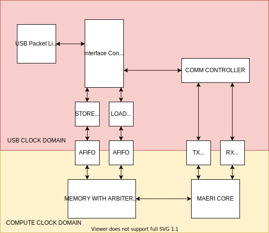

# MAERI 0.1

[Not yet ready!]

An end to end implementation of an ML CNN accelerator.

 - Go from Tensorflow down to FPGA.
 - You can stream in an image to be classified over 
ethernet to the FPGA as many times as you want
without reconfiguring.
 - 100% FOSS. Even the FPGA PNR and Synth tools
(which were reverse engineered).
 - RTL extensively **formally** verified.

# Overview
Below is a high level overview of the hardware.



# Dependencies

 - [yosys](https://github.com/YosysHQ/yosys)
 - [symbiyosys](https://symbiyosys.readthedocs.io/en/latest/quickstart.html#symbiyosys)
 - [yices2](https://github.com/SRI-CSL/yices2)

 Yosys and yices2 can both be installed with [homebrew](https://brew.sh)
 (Mac) or [linuxbrew](https://docs.brew.sh/Homebrew-on-Linux)

 ```bash
brew install bracketmaster/rtl/yosys
brew install SRI-CSL/sri-csl/yices2
```

# Installing

You should probably use a virtual environment.
Change to wherever you install your virtual environments.

```bash
pip3 install virtualenv
mkdir -p ~/.virtualenvs
cd ~/.virtualenvs
python3 -m venv maeri
source ~/.virtualenvs/maeri_v6/bin/activate
git clone https://github.com/BracketMaster/maeri
cd maeri
pip3 install -e .
```

# Running Tests

To run all the unit tests in succession,
do including formal tests:

```
python -m unittest discover -s test -v
```

Typically, the simulator state is preserved 
between unit tests to avoid having to setup
and tear down the simulator between each 
unit test.

## Running Formal Tests

To run a specific formal unit test(or really
any unit test), do something to the effect
of:

```
python3 test/gateware/test_adder_node.py
```

# Status

Need to update this...

# LOC Count
Keep forgetting how to do this.

```bash
find . -type f -name "*.py" | xargs wc -l
```